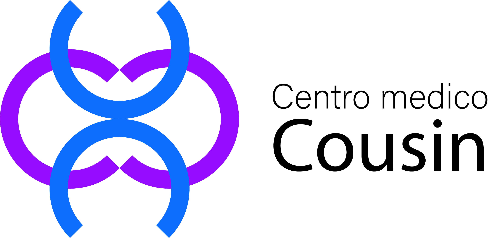

<h1 align="center">Centro médico Cousin</h1>

Este proyecto es un sistema de gestión de historias clínicas y estudios médicos diseñado para proporcionar una solución integral para clínicas médicas. Permite a los médicos administrar de manera eficiente las historias clínicas y los estudios médicos de sus pacientes, garantizando un acceso seguro a la información médica. Los pacientes tienen la posibilidad de visualizar sus propios estudios e historias clínicas, así como la capacidad de descargar los estudios para su propio uso y referencia. Esta plataforma busca mejorar la experiencia tanto para los médicos como para los pacientes, facilitando la gestión y acceso a la información médica de manera confiable y accesible. Al abordar la necesidad de una gestión eficiente y segura de la información médica, este sistema ofrece una solución integral para mejorar el flujo de trabajo clínico y la experiencia del paciente.

    

 
 

    
    

<h2 align="center">Equipo de Desarrollo</h2>

<table align="center">
  <tr>
    <td align="center">
      
      
<strong>Consuelo León Abarca</strong>

      
Diseñadora UX/UI

       
       
          
    </td>
    <td align="center">
      
      
<strong>Sebastián Laverde</strong>

      
Desarrollador Full Stack

       
       
          
    </td>
</tr>
<tr>
    <td align="center">
      
      
<strong>Brenda Huemer</strong>

      
Desarrolladora Full Stack

       
       
          
    </td>
    <td align="center">
      
      
<strong>Miguel Angel Rizzi</strong>

      
Desarrollador Full Stack

       
       
      
    </td>
  </tr>
</table>

<h2 align="center">Tecnologías utilizadas</h2>

  
  
  
  
  
  

<h2 align="center">Instalación y ejecución</h2>

<ol>
    <li>Clone este repositorio en su máquina local usando el comando <code>git clone https://github.com/No-Country/c16-72-ft-python.git</code>.</li>
    <li>Si usa Visual Studio Code, abra el archivo <code>requirements.txt</code> y haga clic en Crear ambiente, luego elija Venv y el intérprete Python, y finalmente 
    pregunte por las dependencias: elija <code>requirements.txt</code>. Esto creará el entorno virtual e instalará todas las librerías necesarias para ejecutar el proyecto. 
    </li>
    <li>Si prefiere instalarlo de manera manual, use el comando <code>python -m venv .venv</code>. Esto creará una carpeta llamada <code>.venv</code> dentro del directorio      del proyecto. Active el entorno virtual usando el comando <code>source .venv/bin/activate</code> en Linux o Mac, o <code>.venv\Scripts\activate</code> en Windows.           Instale las dependencias del proyecto usando el comando <code>pip install -r requirements.txt</code>.</li>
    <li>Asegúrese de tener MySQL instalado y configurado en su máquina local, cree una nueva base de datos para el proyecto. Puede hacerlo a través de la interfaz de línea de comandos de MySQL o usando una herramienta de administración de bases de datos como MySQL Workbench.</li>
    <li>Para configurar las variables de entorno crea un archivo llamado <code>.env</code> en el directorio raíz de tu proyecto, a la altura del archivo <code>settings.py</code>. Dentro de este archivo, define las variables de entorno de la siguiente manera: 
    <pre>
        SECRET_KEY=clave_secreta
        DEBUG=True
        DB_NAME= nombre_de_la_base_de_datos
        DB_USER= usuario_MySQL
        DB_PASSWORD=contraseña_MySQL
        DB_HOST=localhost
        DB_PORT=3306
    </pre>
    </li>
    <li>Ejecute las migraciones de la base de datos usando los comandos <code>python manage.py makemigrations</code> y <code>python manage.py migrate</code>. Esto creará las tablas necesarias en la base de datos.</li>
    <li>Para ejecutar el servidor de desarrollo, muévase hasta el directorio del proyecto usando el comando <code>cd project</code> y use el comando <code>python manage.py runserver</code>. Esto iniciará el servidor en el puerto 8000 de su máquina local. Abre tu navegador y navega a <a href="http://localhost:8000">http://localhost:8000</a> para ver la aplicación en acción.</li>
    <li>Si quiere detener el servidor, simplemente presione <code>CTRL + C</code> en la consola donde está ejecutándose.</li>
</ol>

<h2 align="center">Uso</h2>

Una vez que el servidor esté en funcionamiento, puedes acceder al sistema a través de tu navegador web. Los médicos podrán iniciar sesión para administrar las historias clínicas y los estudios médicos. Los pacientes podrán iniciar sesión para ver y descargar sus propios estudios e historias clínicas.

El sistema proporciona una interfaz intuitiva para que los médicos y pacientes gestionen y accedan a la información médica de manera segura y eficiente. Los médicos podrán agregar, editar y eliminar historias clínicas y estudios médicos, mientras que los pacientes tendrán acceso a su propia información para un mayor control y seguimiento de su salud.

<a href="https://www.nocountry.tech" target="_blank">
  

    
  

</a>

Queremos expresar nuestro sincero agradecimiento a No Country, una organización dedicada a brindar la oportunidad de poner a prueba habilidades en un entorno laboral simulado donde junto a otros roles desarrollar MVPs y validar la experiencia real, ayudando así a los participantes a desarrollar habilidades blandas necesarias para conseguir su primer trabajo. Valoramos profundamente el compromiso de No Country con el crecimiento profesional y agradecemos su contribución a este proyecto. Su apoyo ha sido fundamental en el desarrollo y éxito de nuestra iniciativa.

